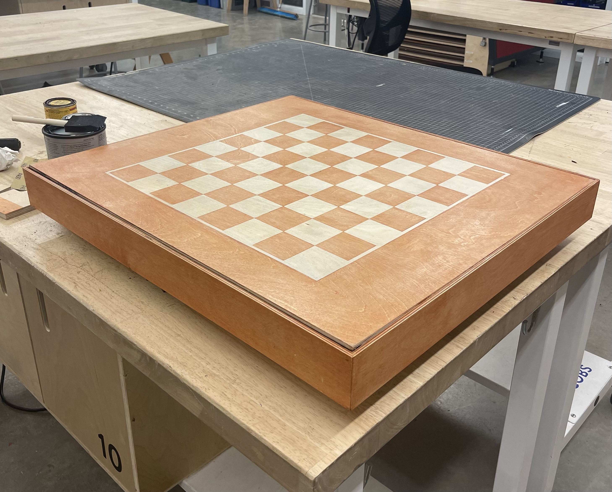
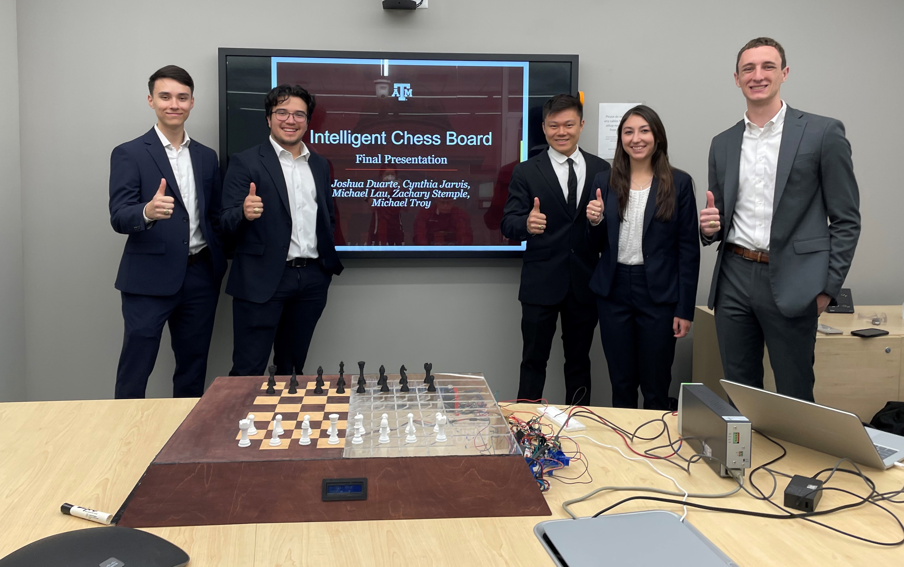

___

# 
**Gambit** 

---

 Introducing Gambit - the intelligent chessboard for single players. Gambit combines cutting-edge technology with the timeless game of chess to bring a unique and engaging experience to players of all skill levels.

With its innovative gantry mechanism, inlaid sensing system, and advanced chess engine, Gambit offers the full experience of playing chess on a physical board - but with the added benefit of being able to play against a challenging and dynamic opponent. Whether you're looking to improve your chess skills or simply enjoy a game on your own, Gambit is the perfect solution. 

    
    

Gambit Iterations One and Three (current) Respectively

___

# **Inspiration**

 The idea for Gambit was born in January of 2021, at the height of the pandemic, when social distancing measures made it difficult to play physical chess with others. As a mechanical engineer, I saw this as an opportunity to not only scratch my itch for chess, but also to challenge myself by incorporating a range of mechanical, electrical, and computer science concepts into the project.

Gambit represents the convergence of my passion for chess and engineering, and my goal was to create a product that not only satisfied my personal need, but could also benefit others who find themselves in similar situations. Whether you're looking to improve your chess skills, want to enjoy a game on your own, or are simply interested in exploring the intersection of technology and chess, Gambit has something to offer. 

___

# **Timeline and Current Status** 

 
In January 2021, the seeds of Gambit were planted as I embarked on a solo journey to bring my passion for chess and engineering to life. A few months later, I was presented with an opportunity to turn my idea into a reality when I received an email inviting me to submit a proposal for my senior design capstone at Texas A&M University. My proposal was accepted and, for the next year, I worked alongside four other mechanical engineers to bring Gambit to life.

By May 2022, we had successfully created a functional prototype with a massive footprint of approximately 5 inches tall, 32 inches long, and 27 inches wide. Despite the aesthetic appeal of a top plate that was half wood and half acrylic, it presented significant mechanical challenges. Despite these challenges, I was undeterred and continued to work on the project on my own, now at the University of California, Berkeley.

Texas A&M Capstone Team

Armed with a makerspace and a renewed sense of determination, I set out to create the third iteration of Gambit. This version was much smaller and more compact, standing at 2.5 inches tall, 27 inches long, and 24 inches wide. I also made significant improvements to the gantry system, sensing system, and chess engine, ensuring that Gambit would be a user-friendly and enjoyable experience for players of all skill levels. 

    
    

Gambit Piece and Internal Gantry Movement

The journey to bring Gambit to life has been a long and challenging one, but I am proud of the work that I have accomplished and look forward to continuing to refine and improve upon this exciting project.

## 3/14/2023

The hardware and cable managmenet associated with the project has been completed. The system integration is currently being completed. To be complete, a complete game of chess must be played that included both castling capabilities and the board or the user winning. 

3-14-2023 Board Status

___
## 3/21/2023
 
The board has since been made capable to play a full game of chess. Below is a clip of a couple of movements completed by myself and the board. 
  

In the next few weeks, the board will be worked on to make it run more smoothly with respect to the boards movements. The code will also be adjusted to interact with the user in a more friendly manner.

Playing against Gambit

